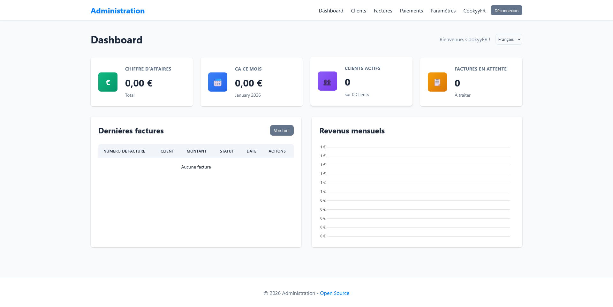
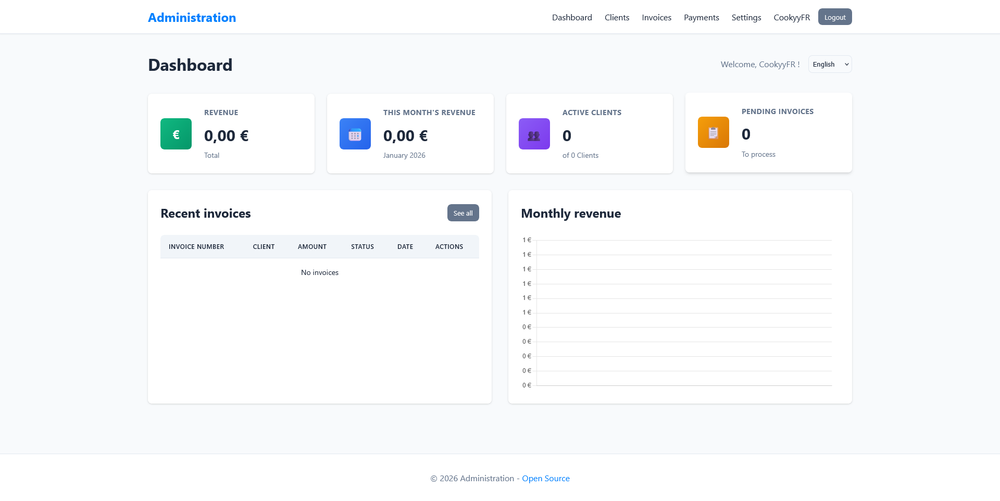
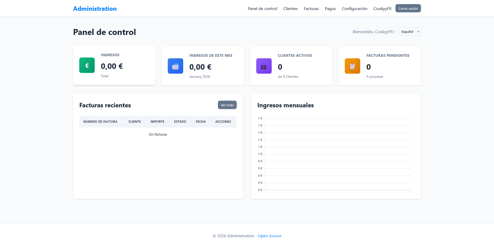
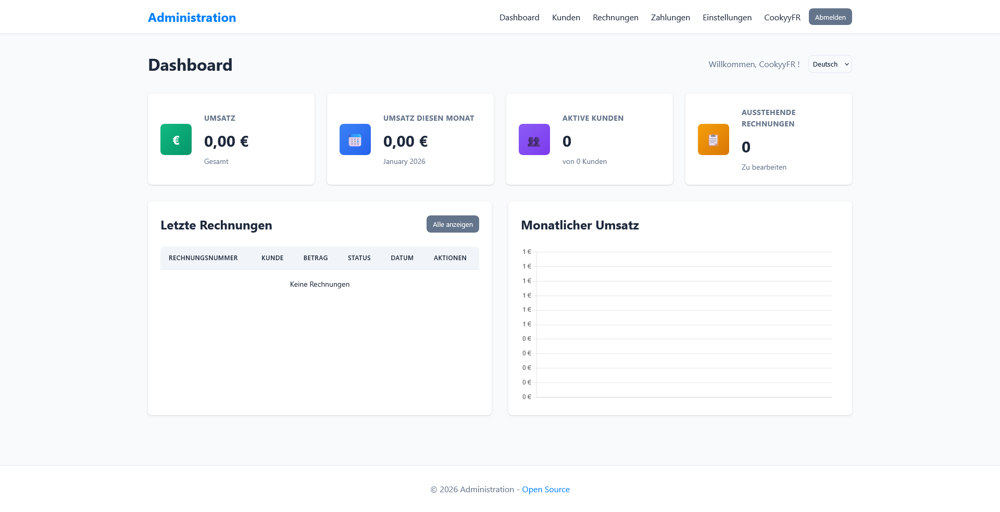

# Dashboard Universel pour Créateurs/Freelances

Un dashboard complet et open source pour gérer vos revenus, factures, clients et paiements. Parfait pour les créateurs de contenu, freelances et entrepreneurs indépendants.

## 🌟 Fonctionnalités

- ✅ **Gestion des clients** : Ajoutez, modifiez et suivez vos clients
- 💰 **Gestion des factures** : Créez et gérez vos factures avec calcul automatique de la TVA
- 💳 **Paiements** : Enregistrez et suivez vos paiements
- 📊 **Statistiques** : Visualisez votre chiffre d'affaires, revenus mensuels et clients actifs
- 🔗 **Intégrations** : Connectez Stripe et PayPal pour les paiements en ligne
- 👤 **Multi-utilisateurs** : Chaque utilisateur a son propre espace isolé
- 📱 **Responsive** : Interface moderne et adaptée à tous les écrans
- 🎨 **Personnalisation** : Personnalisez le nom du projet, le favicon et la couleur du thème
- 🔧 **Installation guidée** : Installation en 3 étapes avec assistant visuel
- 🌍 **Multi-langues** : Support de 4 langues (Français, English, Español, Deutsch)
- 🎨 **Personnalisation complète** : Nom du projet, favicon, couleur du thème
- 🔒 **Sécurisé** : Authentification et protection des données

## 📸 Images

### Support multi-langues

#### Français

*Interface en français*

#### English

*Interface en anglais*

#### Espagnol

*Interface en espagnol*

#### Allemand

*Interface en allemand*

## 📋 Prérequis

- PHP 7.4 ou supérieur
- MySQL 5.7 ou supérieur (ou MariaDB)
- Serveur web (Apache, Nginx, etc.)
- Extension PDO pour PHP
- Extension MySQLi ou PDO_MySQL pour PHP

## 🚀 Installation

### 1. Télécharger les fichiers

Clonez ou téléchargez ce repository sur votre serveur web.

```bash
git clone https://github.com/votre-repo/dashboard-freelance.git
cd dashboard-freelance
```

### 2. Configurer les permissions

Assurez-vous que PHP peut écrire dans le répertoire :

```bash
chmod 755 .
chmod 644 *.php
```

### 3. Lancer l'installation

1. Ouvrez votre navigateur et accédez à : `http://votre-domaine.com/install.php`
2. Suivez l'assistant d'installation en 3 étapes :
   - **Étape 1 - Base de données** : Configurez la connexion MySQL (la base sera créée automatiquement si elle n'existe pas)
   - **Étape 2 - Compte administrateur** : Créez votre premier compte utilisateur
   - **Étape 3 - Vérification** : Vérifiez les informations avant de finaliser

### 4. Configuration automatique

L'installateur va automatiquement :
- Créer la base de données si elle n'existe pas
- Créer toutes les tables nécessaires
- Générer le fichier `config.php`
- Créer votre compte administrateur

### 5. Se connecter

Une fois l'installation terminée :
1. Allez sur `http://votre-domaine.com/login.php`
2. Connectez-vous avec vos identifiants

## 📁 Structure du projet

```
dashboard-freelance/
├── assets/
│   ├── css/
│   │   └── style.css          # Styles CSS
│   └── js/
│       └── main.js            # JavaScript principal
├── database/
│   └── schema.sql             # Schéma de la base de données
├── includes/
│   ├── auth.php               # Fonctions d'authentification
│   ├── database.php           # Connexion à la base de données
│   ├── header.php             # En-tête des pages
│   ├── footer.php             # Pied de page
│   ├── stripe.php             # Intégration Stripe
│   └── paypal.php             # Intégration PayPal
├── install.php                # Script d'installation
├── login.php                  # Page de connexion
├── register.php               # Page d'inscription
├── index.php                  # Dashboard principal
├── clients.php                # Gestion des clients
├── invoices.php               # Gestion des factures
├── invoice.php                # Détails d'une facture
├── payments.php               # Gestion des paiements
├── settings.php               # Paramètres (Stripe, PayPal, personnalisation)
├── logout.php                 # Déconnexion
├── lang/                      # Fichiers de traduction
│   ├── fr.php                 # Français
│   ├── en.php                 # Anglais
│   ├── es.php                 # Espagnol
│   └── de.php                 # Allemand
├── includes/
│   ├── language.php           # Système de gestion des langues
│   ├── auth.php               # Fonctions d'authentification
│   ├── database.php           # Connexion à la base de données
│   ├── header.php             # En-tête des pages
│   ├── footer.php             # Pied de page
│   ├── stripe.php             # Intégration Stripe
│   └── paypal.php             # Intégration PayPal
├── config.php                 # Configuration (généré automatiquement)
├── config.php.example         # Exemple de configuration
├── README.md                  # Documentation principale
├── CONTRIBUTING.md            # Guide de contribution
├── CHANGELOG.md               # Historique des modifications
└── LICENSE                    # Licence MIT
```

## 🔧 Configuration

### Configuration de la base de données

Le fichier `config.php` est généré automatiquement lors de l'installation. Il contient :

```php
define('DB_HOST', 'localhost');
define('DB_NAME', 'dashboard_freelance');
define('DB_USER', 'votre_utilisateur');
define('DB_PASS', 'votre_mot_de_passe');
```

### Intégration Stripe

1. Connectez-vous à votre [tableau de bord Stripe](https://dashboard.stripe.com/apikeys)
2. Récupérez vos clés API (test ou production)
3. Allez dans **Paramètres** > **Stripe** dans l'application
4. Collez vos clés API

### Intégration PayPal

1. Créez un compte sur [PayPal Developer](https://developer.paypal.com)
2. Créez une application dans votre tableau de bord
3. Récupérez votre Client ID et Secret
4. Allez dans **Paramètres** > **PayPal** dans l'application
5. Collez vos identifiants

## 📖 Utilisation

### Gérer les clients

1. Allez dans **Clients**
2. Cliquez sur **+ Ajouter un client**
3. Remplissez les informations
4. Sauvegardez

### Créer une facture

1. Allez dans **Factures**
2. Cliquez sur **+ Créer une facture**
3. Sélectionnez un client
4. Remplissez les détails (montant, TVA, dates)
5. Le total TTC est calculé automatiquement
6. Sauvegardez

### Enregistrer un paiement

1. Allez dans **Paiements**
2. Cliquez sur **+ Enregistrer un paiement**
3. Liez le paiement à une facture (optionnel)
4. Remplissez les informations
5. Le statut de la facture sera mis à jour automatiquement si elle est liée

### Visualiser les statistiques

Le dashboard affiche automatiquement :
- Chiffre d'affaires total
- CA du mois en cours
- Nombre de clients actifs
- Factures en attente
- Graphique des revenus mensuels (12 derniers mois)

### Personnaliser l'application

1. Allez dans **Paramètres**
2. Configurez les informations de votre entreprise
3. Personnalisez le nom du projet
4. Choisissez un favicon parmi les emojis proposés
5. Sélectionnez la couleur du thème
6. Choisissez la langue de l'interface (Français, English, Español, Deutsch)

### Changer la langue

1. Allez dans **Paramètres** > **Informations de l'entreprise**
2. Sélectionnez la langue souhaitée dans le menu déroulant "Langue de l'application"
3. Enregistrez les modifications
4. L'interface se met à jour automatiquement dans la langue choisie

## 🌐 Support multi-langues

L'application supporte actuellement **4 langues** :
- 🇫🇷 **Français** (par défaut)
- 🇬🇧 **English**
- 🇪🇸 **Español**
- 🇩🇪 **Deutsch**

### Utilisation des traductions dans le code

Dans vos fichiers PHP, utilisez la fonction `__()` pour traduire :

```php
<?php echo __('dashboard'); ?>     // Affiche "Dashboard" ou "Panel de control" selon la langue
<?php echo __('welcome'); ?>       // Affiche "Bienvenue" ou "Welcome"
<?php echo __('settings'); ?>      // Affiche "Paramètres" ou "Settings"
```

### Ajouter une nouvelle langue

1. Créez un nouveau fichier dans `lang/` (ex: `it.php` pour l'italien)
2. Copiez la structure d'un fichier existant (ex: `fr.php`)
3. Traduisez toutes les clés
4. Ajoutez la langue dans `includes/language.php` dans la fonction `getAvailableLanguages()`
5. Ajoutez l'option dans le formulaire de paramètres (`settings.php`)

## 🔒 Sécurité

- Les mots de passe sont hachés avec `password_hash()` (bcrypt)
- Protection contre les injections SQL avec PDO et requêtes préparées
- Authentification par session
- Protection CSRF recommandée (à implémenter si nécessaire)
- Validation des entrées utilisateur

## 🤝 Contribution

Les contributions sont les bienvenues ! N'hésitez pas à :
- Signaler des bugs
- Proposer des améliorations
- Soumettre des pull requests

## 📝 Licence

Ce projet est open source et disponible sous licence **MIT**. Voir le fichier [LICENSE](LICENSE) pour plus de détails.

Vous êtes libre de :
- ✅ Utiliser le projet
- ✅ Le modifier
- ✅ Le distribuer
- ✅ L'utiliser commercialement

## 🐛 Résolution de problèmes

### Erreur de connexion à la base de données

- Vérifiez que MySQL est démarré
- Vérifiez les identifiants dans `config.php`
- Assurez-vous que l'utilisateur MySQL a les permissions nécessaires

### Page blanche

- Activez l'affichage des erreurs PHP
- Vérifiez les logs d'erreur du serveur
- Assurez-vous que toutes les extensions PHP sont installées

### Graphique ne s'affiche pas

- Vérifiez que Chart.js se charge correctement
- Vérifiez la console JavaScript du navigateur
- Assurez-vous d'avoir des données à afficher

## 📞 Support

Pour toute question ou problème, ouvrez une issue sur GitHub.

## 🎯 Roadmap

- [ ] Export PDF des factures
- [ ] Email automatique des factures
- [ ] Rappels de paiement
- [ ] Rapports détaillés
- [ ] Multi-devises
- [ ] API REST
- [ ] Application mobile

---

## 📚 Documentation

- [README.md](README.md) - Documentation principale
- [CONTRIBUTING.md](CONTRIBUTING.md) - Guide pour les contributeurs
- [CHANGELOG.md](CHANGELOG.md) - Historique des modifications
- [QUICK_START.md](QUICK_START.md) - Guide de démarrage rapide pour GitHub

---

**Développé avec ❤️ pour la communauté des créateurs et freelances**

⭐ Si ce projet vous est utile, n'hésitez pas à lui donner une étoile sur GitHub !

